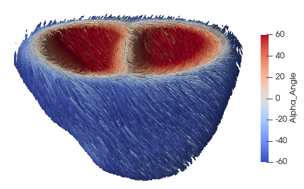
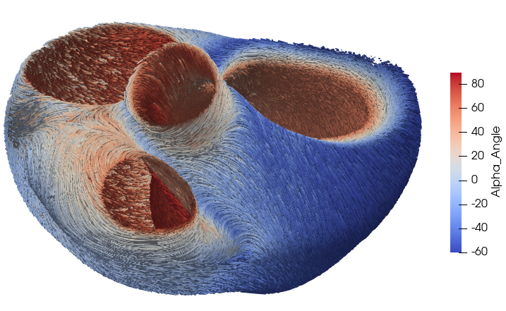

# SV-fibergen
Python + SVmultiphysics codes for fiber generation. Two methods are implemented:
* Bayer et al. (2012). [link](https://doi.org/10.1007/s10439-012-0593-5)
* Doste et al. (2018). [link](https://doi.org/10.1002/cnm.3185)

### Examples
The `main_bayer.py` and `main_doste.py` are scripts to run both methods in the geometry described in the `example/truncated` and `example/ot` folders respectively.




Note that the Doste methods needs a geometry with outflow tracts to be run (each valve needs to be defined as a separated surface). Bayer can be run in any biventricular geometry.


### Updates to the old code
* All operations are vectorized now.
* The SVmultiphysics solver now solves a Laplace equation.
* In Bayer: For the bislerp interpolation, instead of using the correction described in Bayer et al. (that returns a discontinuity), the basis are flipped to maintain a coherent fiber direction (see function `generate_fibers_BiV_Bayer_cells` in `FibGen.py`).
* In Bayer: The beta angles were not being included correctly. The second rotation was being applied respect the first vector (circumferential) when it should be respect to the second vector (longitudinal) (see function `generate_fibers_BiV_Bayer_cells` in `FibGen.py`).

### Notes on SVmultiphysics solver

To solve a Laplace equation directly from the transient HEAT solver in SVmultiphysics, in `<GeneralSimulationParameters>` we need to set,
```
<Number_of_time_steps> 1 </Number_of_time_steps>
<Time_step_size> 1 </Time_step_size>
<Spectral_radius_of_infinite_time_step> 0. </Spectral_radius_of_infinite_time_step>
```
and in `<Add_equation type="heatS" >`,
```
<Conductivity> 1.0 </Conductivity>
<Source_term> 0.0 </Source_term>
<Density> 0.0 </Density>
```
This will allow us to solve the Laplace equation directly in 1 timestep and 1 iteration.