# Results and validation

This document presents validation results for fiber generation using two methods: the Bayer method and the Doste method.

The `examples` folder contains two geometries: a truncated biventricle (`examples/truncated`) for the Bayer method and a biventricle with outflow tracts (`examples/ot`) for the Doste method. 

Validation scripts (`validation_bayer.py` and `validation_doste.py`) can be run to generate the correlation plots shown below. ParaView Python scripts (`paraview_bayer.py` and `paraview_doste.py`) can be used to generate the different visualization views (fiber, sheet, sheet-normal orientations) for each case.

Notes:
- To run the `validation*.py` scripts the file with the Laplace results must be created. This can be done using the `main*.py` scripts.
- To run the `paraview*.py` you must run the `validation*.py` codes first. 
- `paraview*.py` codes are run within the Paraview GUI. To do so, 
   1. Open Paraview, go to the Python Shell (if not visible, go to View, and click so it appears, usually at the bottom panel).
   2. Click on Run Script and select the desire script. 

---

## Bayer Method

The Bayer method results are demonstrated on a truncated biventricular geometry.

### Fiber Orientation

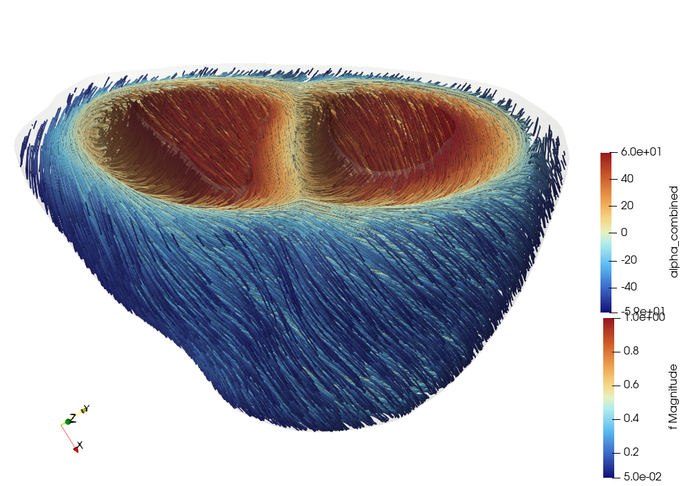

*Figure 1: Fiber orientation field generated using the Bayer method - full view*

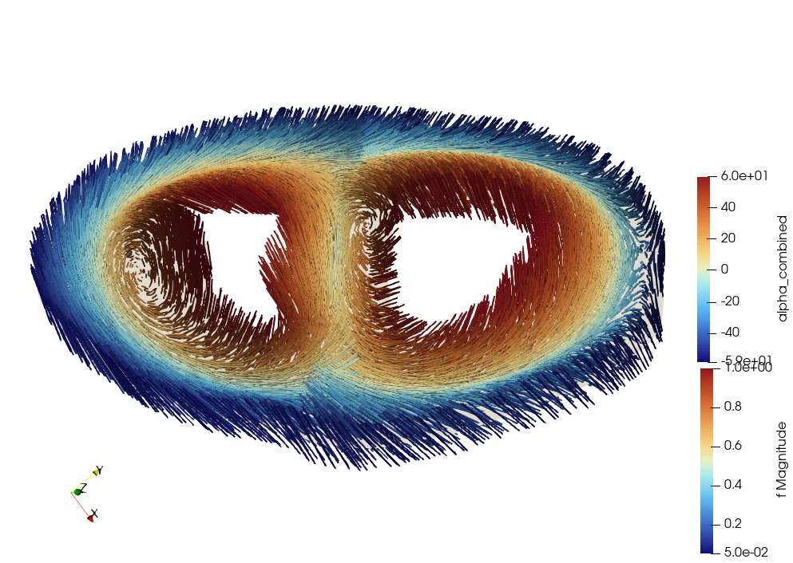

*Figure 2: Fiber orientation field generated using the Bayer method - slice view*

### Sheet Orientation

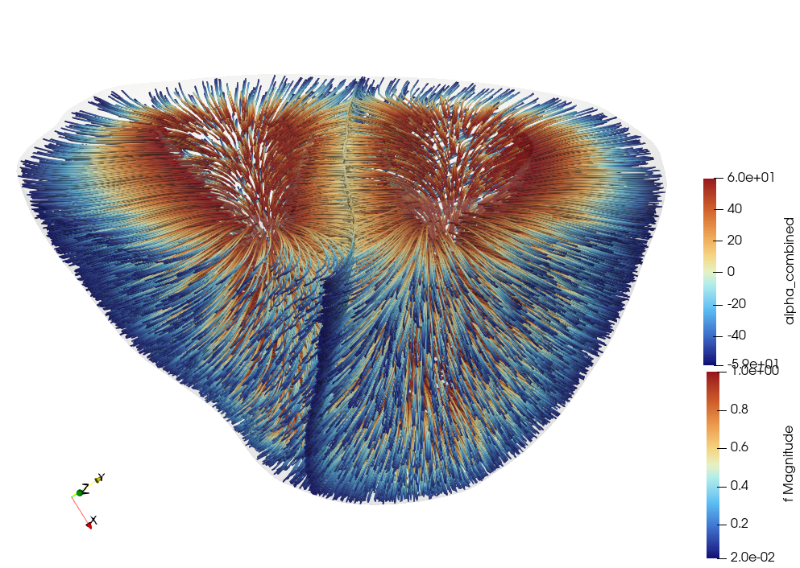

*Figure 3: Sheet orientation field generated using the Bayer method - full view*

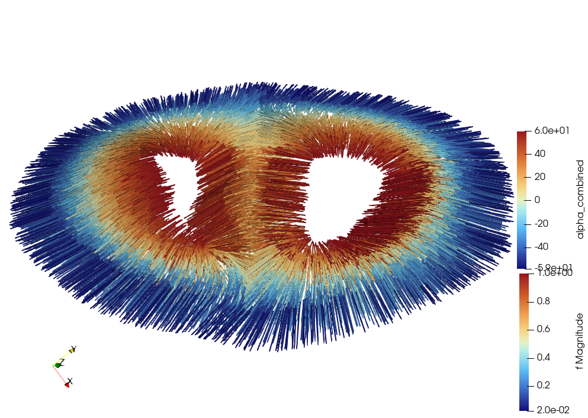

*Figure 4: Sheet orientation field generated using the Bayer method - slice view*

### Sheet-Normal Orientation

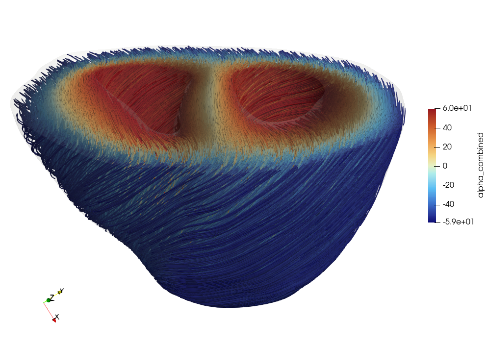

*Figure 5: Sheet-normal orientation field generated using the Bayer method - full view*

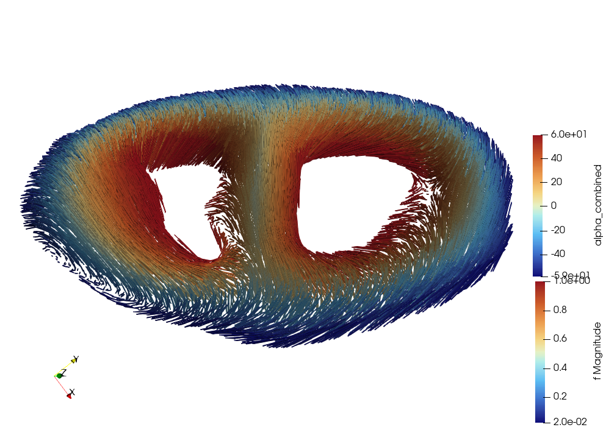

*Figure 6: Sheet-normal orientation field generated using the Bayer method - slice view*

### Angle Correlations

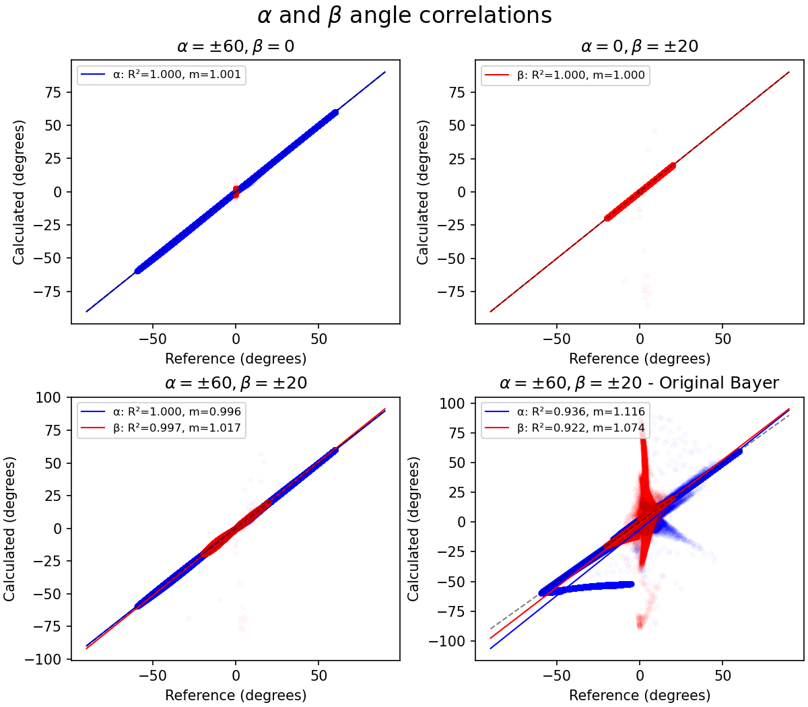

*Figure 7: Correlation plots comparing computed angles with reference values for the Bayer method. Red and blue dots show the $\alpha$ and $\beta$ angles*

---

## Doste Method

The Doste method results are demonstrated on a complete biventricular geometry with outflow tracts.

### Fiber Orientation

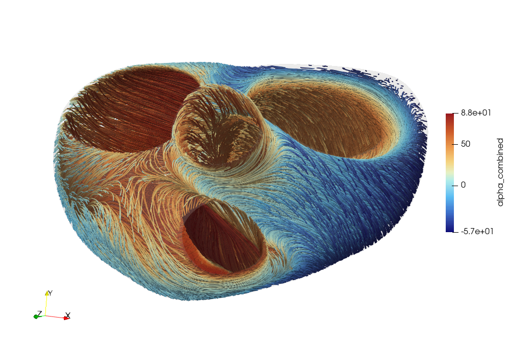

*Figure 8: Fiber orientation field generated using the Doste method - full view*

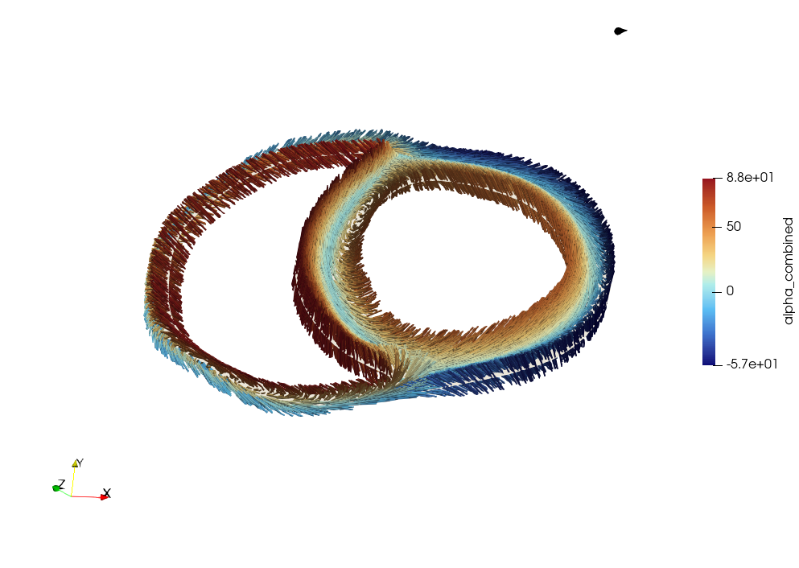

*Figure 9: Fiber orientation field generated using the Doste method - slice view*

### Sheet Orientation

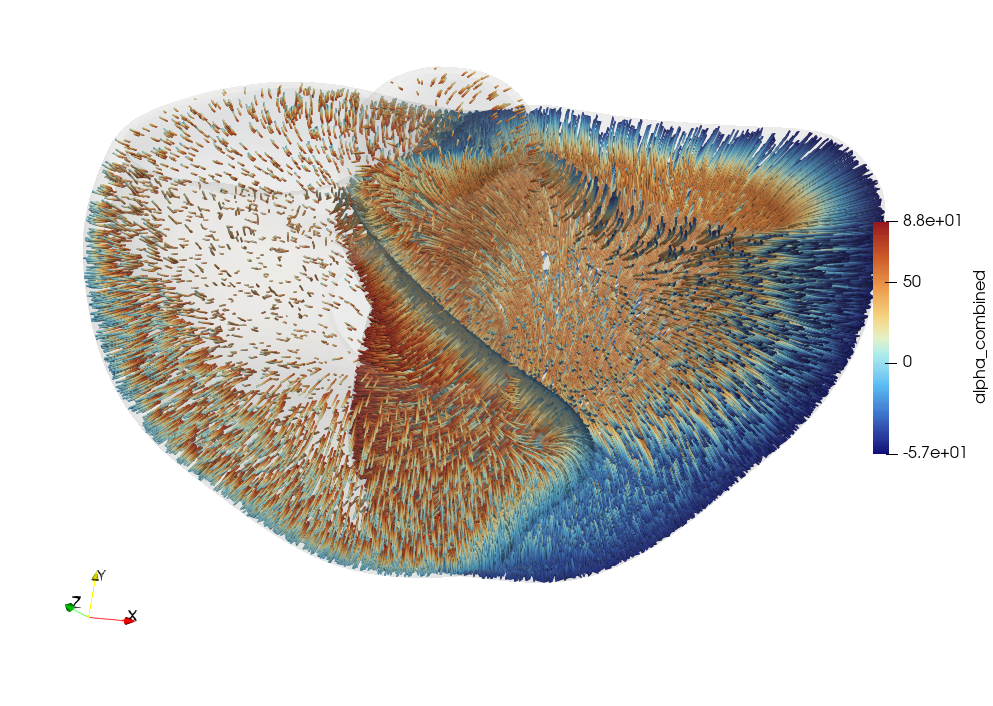

*Figure 10: Sheet orientation field generated using the Doste method - full view*

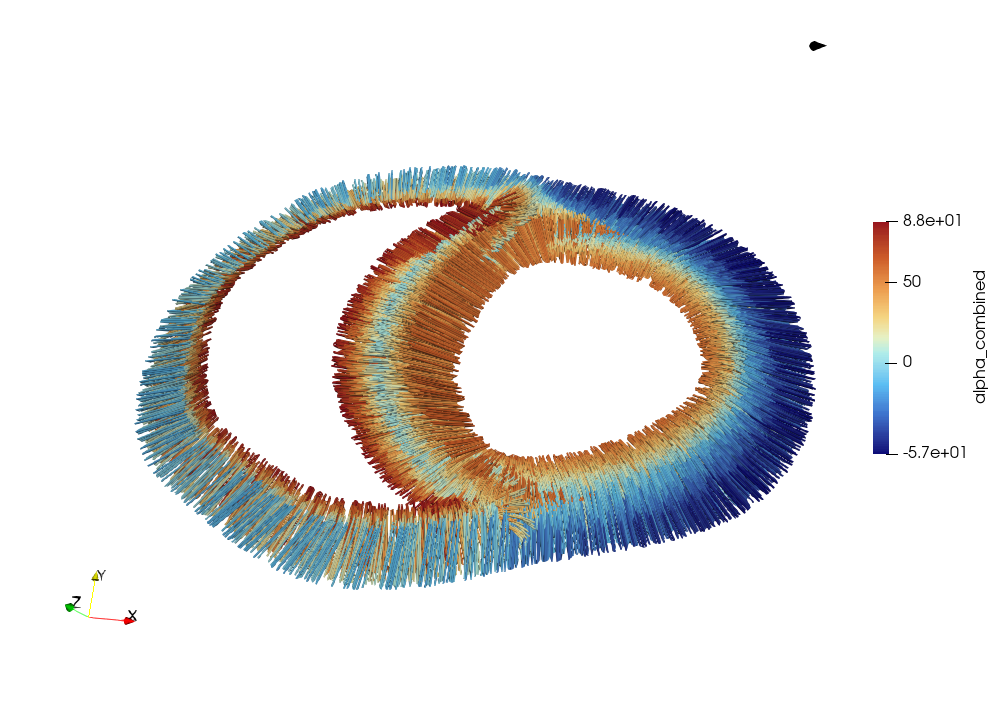

*Figure 11: Sheet orientation field generated using the Doste method - slice view*

### Sheet-Normal Orientation

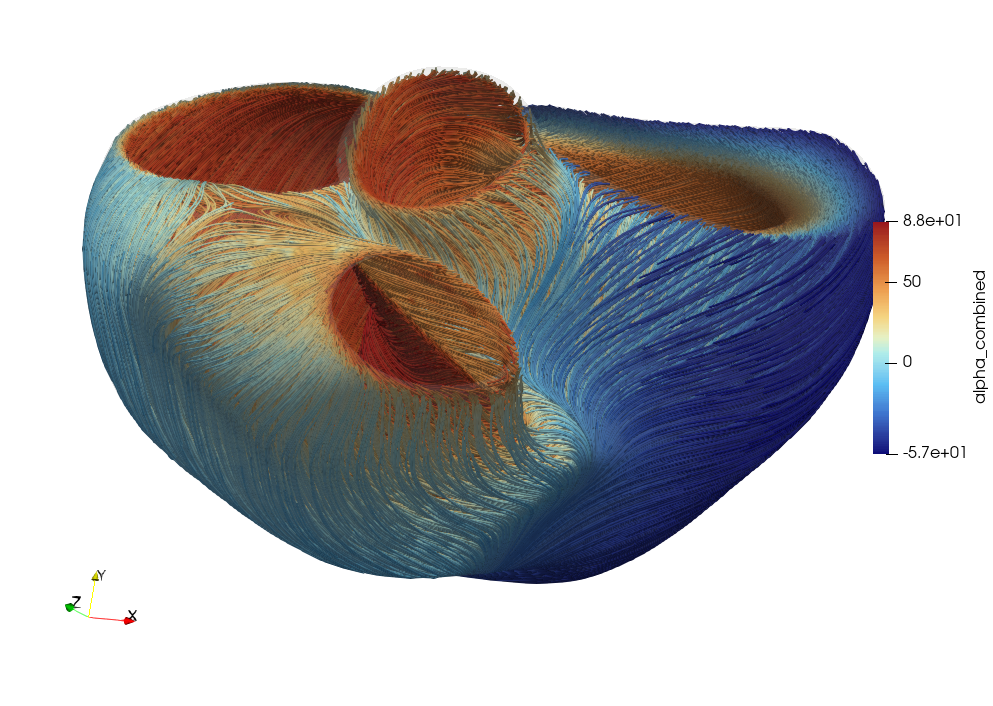

*Figure 12: Sheet-normal orientation field generated using the Doste method - full view*

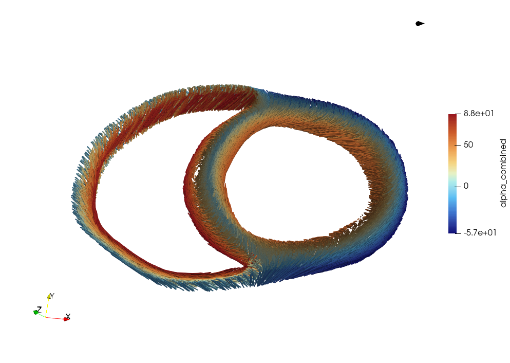

*Figure 13: Sheet-normal orientation field generated using the Doste method - slice view*

### Angle Correlations

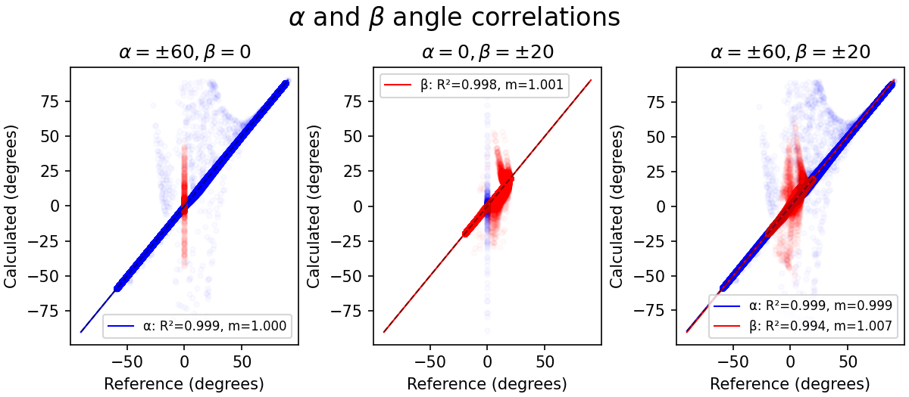

*Figure 14: Correlation plots comparing computed angles with reference values for the Doste method. Red and blue dots show the $\alpha$ and $\beta$ angles**

---